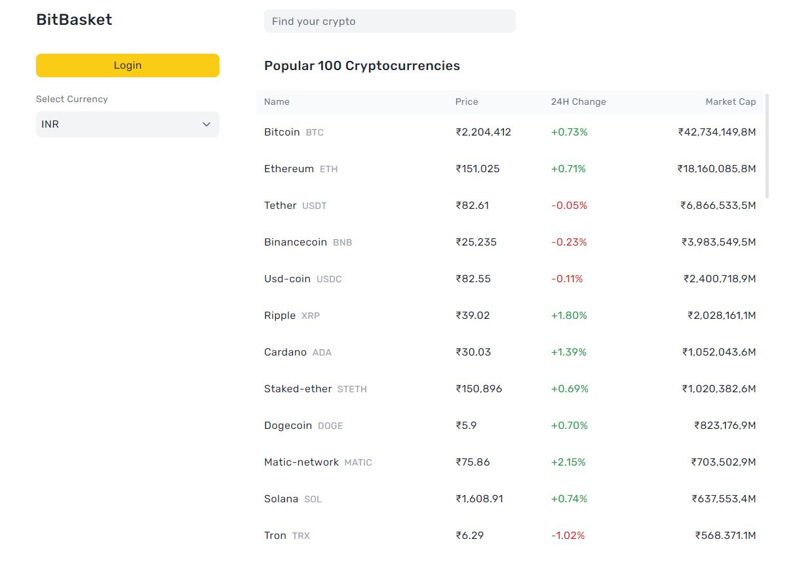
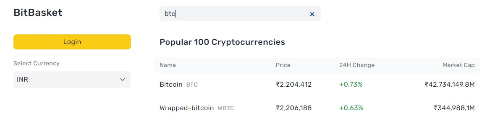
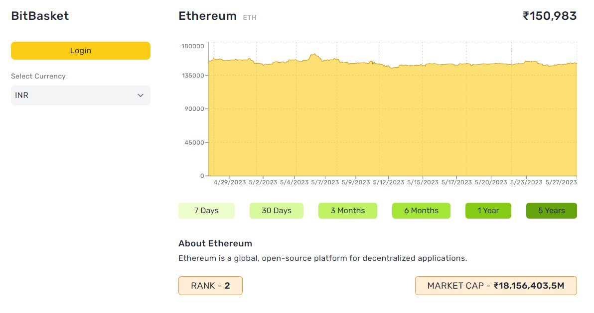
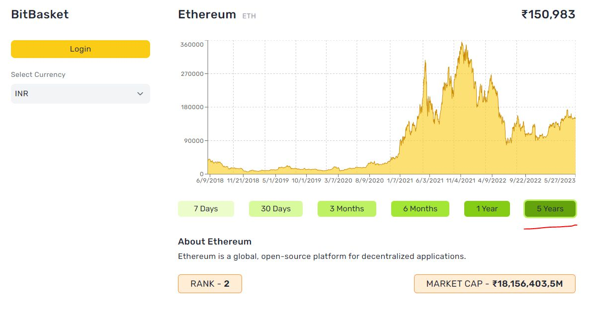
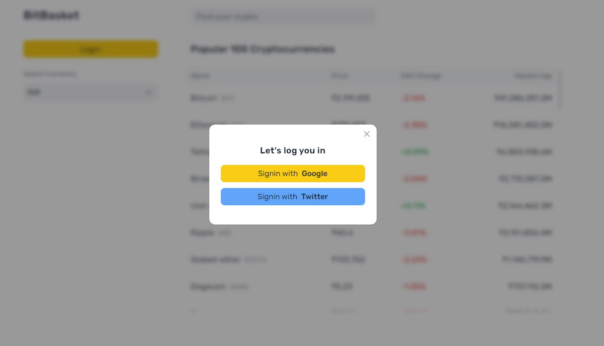
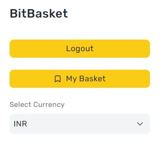
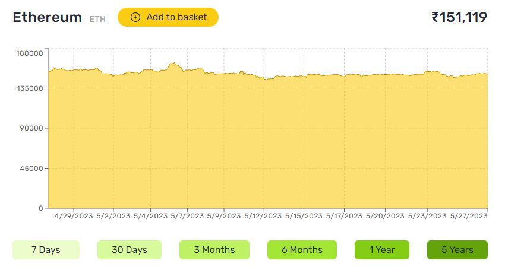
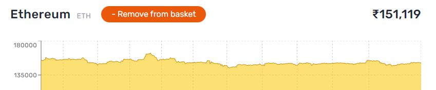
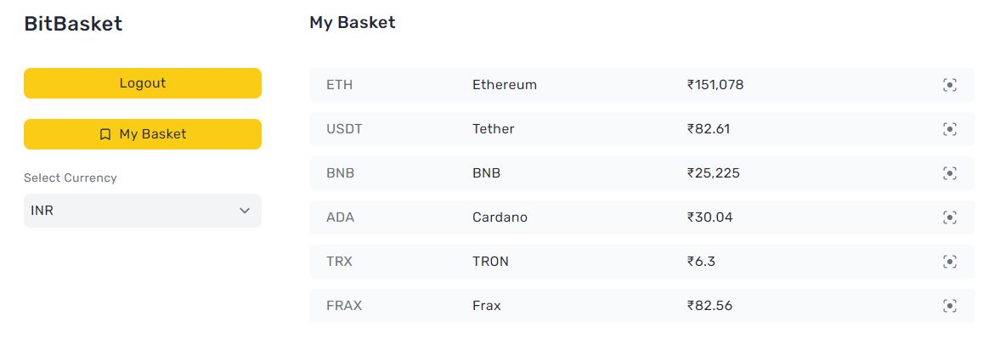

# BitBasket

A web first platform to view and create baskets of cryptocurrencies.

# Live

Bit basket is a web first app. View it on a PC.

View live: [a56-bitbasket.vercel.app](https://a56-bitbasket.vercel.app)

# Screenshots

### Home route (user not logged-in)

### Searching for crypto either using its Symbol or Currency Name

### Single Crypto Data with details including the currency’s historical performance (/coins/ethereum)

### To sort the historical performance data based on years (from 7 days to up to 5 years)

### Google sign-in modal on clicking the login button (using firebase)

### Home route sidebar when the user is logged in

### Feature to allow logged in users to add their desired crypto currency to the basket

### Ethereum added to the user’s basket

### User’s basket: /basket (notice that Ethereum is added to the basket). The icon on extreme right is to view the details of a coin.

